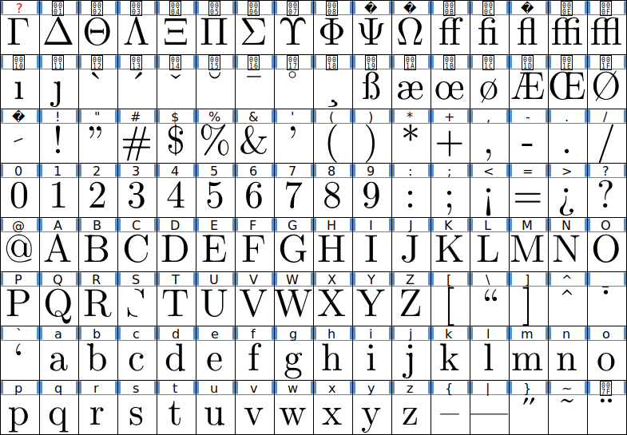
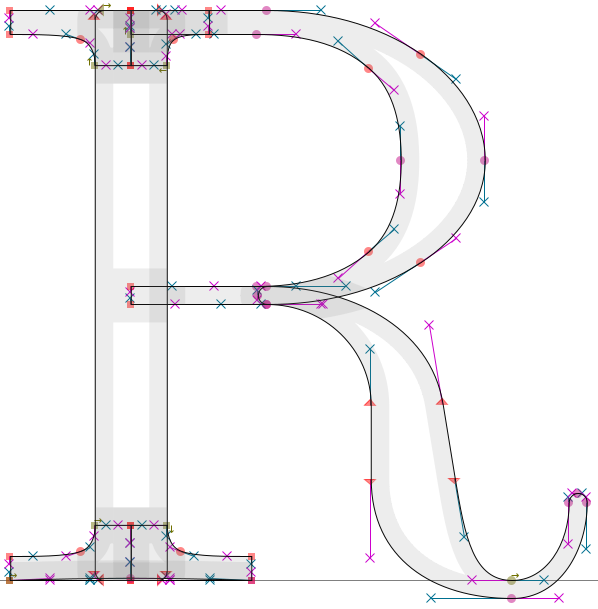
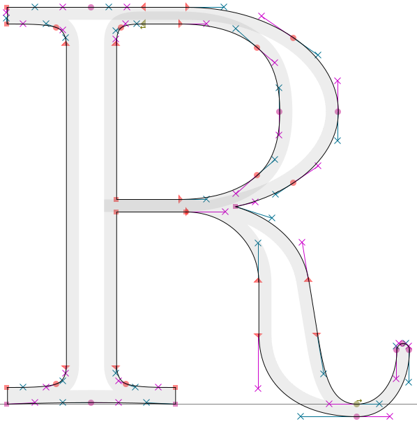
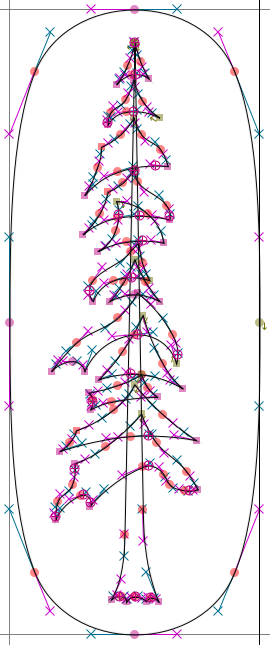
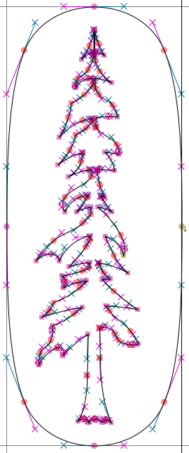
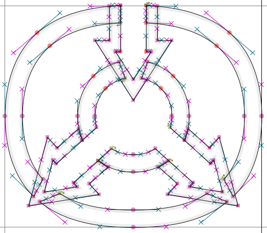
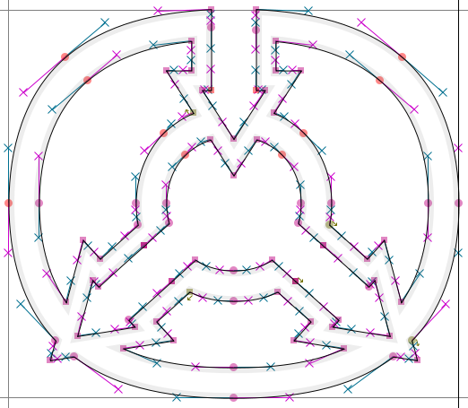

# `mf2ff`

**`mf2ff`** is a tool to create vector fonts from METAFONT code using the Python API of FontForge.\
It is based on a concept of how METAFONT can work together with a vector font generator without the detour of bitmap tracing, described below in the [mf2vec concept](#mf2vec-concept) section. `mf2ff` is the first and, to the developer's knowledge, the only implementation of this concept to date.\
Below you will find some help on how to [set it up](#setup) and how to [use it](#usage).

The tool has not yet been thoroughly tested, but most common METAFONT commands are supported. Besides filling and drawing, also kerning and some ligature commands are supported. Please take a look at the [limitations](#current-limitations-of-the-mf2ff) listed below.

- [`mf2ff`](#mf2ff)
  - [Setup](#setup)
    - [Windows](#windows)
    - [Linux](#linux)
    - [macOS](#macos)
  - [Usage](#usage)
  - [mf2vec concept](#mf2vec-concept)
    - [Details of the concept](#details-of-the-concept)
  - [Background](#background)
    - [Comparison](#comparison)
  - [Examples](#examples)
    - [cmr10](#cmr10)
    - [El Palo Alto](#el-palo-alto)
    - [JofA Logo](#jofa-logo)
  - [Current limitations of the `mf2ff`](#current-limitations-of-the-mf2ff)
  - [Troubleshooting](#troubleshooting)


## Setup
You need to install FontForge and METAFONT to use `mf2ff`.

You may have problems running the `mf2ff` script. One issue may be that you need to run Python 3 with the fontforge module. Below are some tips on how to get it to work. I can't guarantee that this will work on your system, but you should give it a try.

On different operating systems or system configurations where the tips below do not work, check if you use Python and FontForge's Python module is present:
- Run your Python 3 command (`ffpython`, `python3`, `python`). Check that the version info states that you are running `Python 3`.
- `import fontforge` within the interpreter should work without errors.
- `fontforge.font()` should not raise an error.
If this only works in some directories, you should check your `PATH` or `PYTHONPATH` variable.


### Windows
- Download Fontforge from its website: https://fontforge.org/
- Install Fontforge

For temporary access to FontForge's Python version `ffpython`, FontForge comes with a batch file:

- Go to your installation folder of FontForge (e.g. `C:\Program Files (x86)\FontForgeBuilds`) and execute `fontforge-console.bat`
  Since Windows' `set` command changes the `PATH` variable only in the current Command Prompt session, `ffpython` is only available in every location in the Command Prompt in which the batch file was executed.

For permanent access, you need to edit the PATH variable permanently:

- In Windows, search for `environment variables` and open `Edit the system environment variables`. Click on `Environment variables` and edit either the `PATH` variable of your user account or the one of the system if you need access to `ffpython` on multiple user accounts. Now, add FontForge's path (e.g. `C:\Program Files (x86)\FontForgeBuilds\bin`, mind the `\bin`!) to the list.
- `ffpython` is now available in all new Command Prompt windows and you should be able to use `ffpython path/to/mf2ff.py ...`

To easily access the `mf2ff` script from everywhere, do the following:

- As described above, go to the environment variables and add the path of `mf2ff` to the `PYTHONPATH` variable. If there is no `PYTHONPATH` variable yet, add it to the list.
- Now, you should be able to run `mf2ff` with `ffpython -m mf2ff ...` in new Command Prompt sessions.


### Linux
Ubuntu is used here as an example.

Some repositories ship old versions of FontForge with Python 2 support. You may want to build FontForge from source:

- Get the tools to build FontForge:\
  `sudo apt install libjpeg-dev libtiff5-dev libpng-dev libfreetype6-dev libgif-dev libgtk-3-dev libxml2-dev libpango1.0-dev libcairo2-dev libspiro-dev libuninameslist-dev python3-dev ninja-build cmake build-essential`
- If Git is not installed, install Git:\
  `sudo apt install git`
- Clone FontForge's source:\
  `git clone https://github.com/fontforge/fontforge`. This creates a `fontforge/` directory.
- Move to a separate directory inside the `fontforge/` directory:\
  `cd fontforge; mkdir build; cd build`
- Create the Makefile:\
  `cmake -GNinja ..`
- Build FontForge:\
  `ninja`
- Install FontForge:\
  `sudo ninja install`

Note: Check FontFore's documentation if you have problems with this process.

To easily access FontForge's Python module, add it to your PYTHONPATH:

- Put the following line at the end of your `~/.profile` file: `export PYTHONPATH=$PYTHONPATH:/path/to/fontforge/`, where the `/path/to/fontforge/` directory is the one created by cloning FontForge with Git, e.g. `$HOME/fontforge`.
- Reboot.
- Now, you should be able to always use `python3 path/to/mf2ff.py ...` in new shell sessions.

Note: Depending on your system's configuration you need to type `python` instead of `python3` to run Python 3.

To easily access the `mf2ff` script from everywhere, add its location to the PYTHONPATH variable:

- In your home directory, put this at the end of your `~/.profile` file: `export PYTHONPATH=$PYTHONPATH:/path/to/mf2ff/`, where `/path/to/mf2ff/` directory is the one where you put the `mf2ff.py` file, e.g. `$HOME/mf2ff/mf2ff`.
- Reboot.
- Now, you can always run `mf2ff` easily with `python3 -m mf2ff ...` in new shell sessions.

Note: Depending on which dotfile you are using, a restart of the shell instead of a reboot may be sufficient.


### macOS
The solution below uses Homebrew. This way Fontforge is also accessible with Python:

- Install Homebrew as explained at its website: https://brew.sh/. You may need to enter your password multiple times. This will also install Xcode with Python 3.
- On the Terminal, run `brew install fontforge`.
- Now, you can always use `python3 path/to/mf2ff.py ...` in new shell sessions.

Note: Depending on your system's configuration you need to type `python` instead of `python3` to run Python 3.

To easily access the `mf2ff` script from everywhere, add its location to the `PYTHONPATH` variable:

- Edit the appropriate dotfile for your shell and append it with export `PYTHONPATH=$PYTHONPATH:/path/to/mf2ff/`.
  - If you have a macOS Catalina 10.15 or newer, you probably use `zsh`. In your home directory, create or modify the file `.zshenv`.
  - If you have a Mac OS X 10.2 Jaguar or newer, you probably use `bash`. In your home directory, create or modify the file `.bash_profile`.
  - If you have a Mac OS X 10.1 Puma or older, you probably use `tcsh`. In your home directory, create or modify the corresponding file of the `tcsh` shell.
  - If you don't use the shells listed above, you probably changed it by yourself.
- For some shells, you may need to reboot.
- Now, you can always run `mf2ff` with `python3 -m mf2ff ...` in new shell sessions.


## Usage
Examples:
- `python -m mf2ff myfont.mf`
- `python -m mf2ff -ppi=4000 -remove-artifacts -cull-at-shipout -no-sfd -otf path/to/myfont.mf`

Depending on your OS, you need to use `ffpython` or `python3` instead of `python`. See above for [setup](#setup).

By default, `mf2ff` will generate a Spline Font Database (.sfd) file. You can deactivate this using the option `-no-sfd` / `mf2ff.options['sfd'] = False` and `-ttf` / `mf2ff.options['ttf'] = True` or `-otf` / `mf2ff.options['otf'] = True` to generate font files directly.

`mf2ff` doesn't do much cleanup by default, as you may want to manually rework the glyphs. Please refer to the [user guide](docs/user-guide.md) for useful options to perform some automated cleanup, an introduction to using the package in a Python script, or extensions for modern font features. 

Please also take a look at the [limitations](#current-limitations-of-the-mf2ff) that are listed below.


## mf2vec concept
The main idea of the mf2vec concept is to make METAFONT redirect the glyphs' geometries to another program (in the case of `mf2ff`, this program is FontForge) instead of using them to generate a bitmap font. This is possible because METAFONT internally uses the same geometrical description that is subsequently needed in the vector font files—the Bézier curves.\
The detour used by some alternatives of converting the Bézier curves to raster graphics and back to Bézier curves is circumvented. By using directly the geometry, no information gets lost.\
Since METAFONT is used instead of other tools like METAPOST to read `.mf` files, unmodified METAFONT code files can be used and not only the geometry but also character encoding, box sizes, kerning and ligature information etc. is shipped to the vector font without manual rework.

This interception of the information is done by redefining METAFONT commands. As METAFONT can't interact with other programs during runtime, the interpretation of the .mf file and the generation of the font need to be separated in time. Therefore, the information METAFONT would use to generate bitmap graphics is saved in METAFONT's log file. METAFONT's commands are redefined so that METAFONT writes the geometry and font properties in its log file. Once METAFONT has processed all commands of the METAFONT files, the information is read from the log file, processed to create a font and then removed from the log file to keep it clear.

The idea for this approach came up in October 2018. To check for practicability an implementation for FontForge was immediately realized in Python and the range of supported commands was progressively expanded. When initial tests showed that the idea worked, it was decided to make `mf2ff` available to other interested users. This has been happening since March 2019. After a few improvements and bug fixes, development was paused for a few years. Due to community feedback, `mf2ff` development was continued in July 2023.


### Details of the concept
**Basic idea**\
The concept is based on redefining basic METAFONT commands. They are defined in such a way that the information METAFONT normally uses to create the bitmap font is written into the log file. Subsequently, this log file is then read and the instructions are passed to the program generating the vector font from it. For example, `mf2ff` uses FontForge for this purpose. Afterward, the information added by modified METAFONT commands is removed from the log file to keep it clear.

The following diagram illustrates the concept using `mf2ff` as an example.
```
┌──────────┐
│ font.mf  │
└──────────┘
     v
┌──────────┐   ┌───────────┐
│          │ > │ METAFONT  │
│          │   └───────────┘
│          │         v
│          │   ┌───────────┐
│  mf2ff   │ < │ font.log  │
│          │   └───────────┘
│          │
│          │   ┌───────────┐
│          │ > │ FontForge │
└──────────┘   └───────────┘
     v               v
┌──────────┐   ┌────────────────────────────────┐
│ font.log │   │ font.sfd / font.ttf / font.otf │
└──────────┘   └────────────────────────────────┘
```

**Simple Example**\
Adding the following code to a METAFONT file will cause METAFONT not to `fill` the contour `c`, but to write the operations to the log file:

```
def fill expr c =
    message "fill"; show c;
enddef;
```

After METAFONT finished processing the file, a script analyzes the log file and knows that there was a `fill` command and it knows the contour to be filled. This information can be passed to the font processing program to add it to the glyph.

In fact, this process is much more complicated. To be able to process METAFONT files not based on plain METAFONT, commands like `addto` instead of commands like `fill` need to be redefined. But those `addto` commands are more complex; they also form the basis for other plain METAFONT commands like `unfill`, (`un`)`draw`, (`un`)`drawdot` and `erase`. These commands expand to several keywords separating the different parts of information needed to do these different operations (`addto`, `also`, `contour`, `doublepath`, `withpen`, `withweight`).

Another challenge is the colon in conditions and loops. These structures can appear in any other command, even in commands that use the colon as a separator (`ligtable` and `fontdimen`), so `:` has to be redefined like other keywords to output information to the log file. A sophisticated switching between different redefinitions of the colon is required within these commands.

In addition to that, a process needs to be implemented to make it easy to find all the commands in the log file even if there are message commands in the METAFONT file not related to the redefinition of the METAFONT primitives. Those should not be interpreted as information for font generation. Therefore all information written in the log file needs to be enclosed in special keywords that are unlikely to be used in the METAFONT files' message commands.


## Background
METAFONT, developed by D. E. Knuth since 1977, is a program that generates bitmap fonts from files written in the METAFONT language. Bitmap fonts have the disadvantage that they become blurred under magnification. METAFONT was developed so that for the particular resolution of the printer a separate font was generated. Nowadays, vector fonts are standard, and do not have this problem under magnification. Therefore, they are more suitable for use on displays. Moreover, they can be used with every printer without any restrictions.

Besides the mf2vec approach with the `mf2ff` presented here, the following scripts for converting METAFONT files to vector fonts are available:

| Name | Method |
| - | - |
| [MetaType1](https://ctan.org/pkg/metatype1) | METAPOST |
| [mf2pt1](https://ctan.org/pkg/mf2pt1) | METAPOST |
| [mftrace](http://lilypond.org/mftrace/) | Bitmap tracing |
| [TeXtrace](https://pts.50.hu/textrace/) | Bitmap tracing |

In this context, METAPOST means that the program METAPOST is used to convert every single character of the METAFONT file to a vector graphic. After that, the vector graphics are put together to get a vector font. This method has the disadvantage that METAPOST only can process a part of the METAFONT language.

Bitmap tracing means that METAFONT generates a bitmap font first. In a separate program, the bitmap of every glyph is traced and then put together to get a vector font.

Each of the methods has specific downsides. Please take a look at the comparison below for more details.


### Comparison
The following table shows a comparison of the available scripts to convert METAFONT files to vector fonts.

| Characteristic | <a href="https://ctan.org/pkg/metafont" target="_blank" title="METAFONT, CTAN">METAFONT</a> | `mf2ff` | <a href="https://ctan.org/pkg/metatype1" target="_blank" title="MetaType1, CTAN">MetaType1</a> | <a href="https://ctan.org/pkg/mf2pt1" target="_blank" title="mf2pt1, CTAN">mf2pt1</a> | <a href="http://lilypond.org/mftrace/" target="_blank" title="mftrace, Website">mftrace</a> | <a href="https://pts.50.hu/textrace/" target="_blank" title="TeXtrace, Website">TeXtrace</a> |
| - | - | - | - | - | - | - |
| **Script is written in** | – | Python&nbsp;3 | Perl | Perl | Python&nbsp;2 | Perl |
| **METAFONT file processing** | METAFONT | METAFONT | METAPOST | METAPOST | METAFONT | METAFONT |
| **Subsequent processing** | – | FontForge | AWK&nbsp;/&nbsp;t1asm | t1asm | autotrace or Potrace&nbsp;/ t1asm | autotrace |
| **Output format** | ❌ GF&nbsp;/ TFM | ✅ TTF, OTF, SFD | 🤔 PFB | 🤔 PFB | ✅ AFM&nbsp;/ PFA&nbsp;/ PFB&nbsp;/ TTF&nbsp;/ SVG | 🤔 PFB |
| **Output quality** | ❌ bitmap | ✅ vector graphic | ✅ vector graphic | ✅ vector graphic | 🤔 traced bitmap | 🤔 traced bitmap |
| **Redefines non-primitives&nbsp;/ requires non-primitives** | ✅ No | ✅ No | ❌ Yes | ❌ Yes | ✅ No | ✅ No |
| **Unicode support** | ❌ No | ✅ Yes | ❔ | ❌ No | ❌ No | ❌ No |
| **Supports pen-commands** | ✅ Yes | 🤔 Limited | ❌ No | 🤔 Limited | ✅ Yes | ✅ Yes |
| **Supports ligature and kerning commands** | ✅ Yes | 🤔 Limited | ❔ | ❔ | ❔ | ❌ No |
| **Supports variable fonts** | ❌ No | ❌ No, possibly in the future | ❌ No | ❌ No | ❔ | ❌ No |

## Examples
The following are some examples created with `mf2ff`. The outlines and filled characters are shown as they are displayed in FontForge. Note that the results are not perfect yet.

In the `examples` directory, you can find code to generate the results yourself.


### cmr10
Some glyphs of the Computer Modern typefaces are not correctly processed yet, i.e. the middle part of capital S and `sloped_serif` in lowercase letters.


| | | |
| - | - | - |
|  |  |  |

The image on the left was created by deactivating `cull` commands.


### El Palo Alto
The stylized coast redwood tree El Palo Alto which is presented on pages 124-126 of The METAFONTbook. In the left version, the option `cull-at-shipout` is activated. Since the trunk and the topmost branch share an on-curve point, the current implementation causes wrong results there.

| | | | |
| - | - | - | - |
|  |  |  |  |


### JofA Logo
The logo, which is presented on page 138, The METAFONTbook. In the left version, the option `cull-at-shipout` is activated. The filled logo is the same in both cases.
| | | |
| - | - | - |
|  |  |  |


## Current limitations of the `mf2ff`
Since `mf2ff` is still under development and not thoroughly tested, there are a few limitations. They may be addressed in future updates.\
If a specific limitation is holding your project back, open an issue so that future updates can focus on the needs of users.
- Pen commands\
  Only round, elliptical and polygonal pens are supported. It is assumed that a path of length 8 (8 points) is an ellipse. Four of these points are used to calculate the axis lengths and the angle. All paths with other lengths are interpreted as polygons. Thereby only points on the Bézier curve are processed.
  - `penrazor` is not supported (see dangerous_bend_symbol example), FontForge: "Stroke width cannot be zero"
  - The use of `penspeck` raises a warning but the output seems to be ok in some cases.
- The support of `cull` commands is limited.
- Ligature commands\
  Only `:`, `::`, `kern`, `skipto` as well as the ligature operators `=:`, `|=:`, `=:|` and `|=:|` are supported. The ligtable command ignores `>` in operators. Moreover, the operator `||:` is not supported.
- picture type test\
  The `picture` keyword has to be redefined to initialize the picture variables as a FontForge vector layer. As METAFONT uses the type keywords for both, variable declaration and type test in boolean expressions, the `picture` keyword cannot be used to test if a variable is of type `picture`.
- System of equations of picture variables\
  METAFONT's pictures can be interpreted as arrays representing the value of the pixels*. A system of equations of these pictures can be solved by solving systems of equations for each and every pixel. This method cannot be transferred to vector graphics. Therefore systems of equations of pictures are not supported, but simple assignments and assignment-like equations should work fine.\
  \* However, METAFONT stores picture variables by storing the difference between successive pixels.
- Pen and path types are the same\
  In fact, every pen variable is a path variable. Therefore, commands like `makepen` and `makepath` have no effect. Pens and paths cannot be distinguished using `pen` or `path` in a boolean expression. There is a option `is_type` that introduces `is_pen` or `is_path` which might help you to circumvent this problem.
- Nested conditions or nested loops within `ligtable`, `fontdimen`, `charlist` and `extensible` commands\
  In some situations, `mf2ff` needs to redefine the colon (`:`). This may cause problems in processing multiple nested `if`...(`elseif`)...(`end`)...`fi` and/or `for`/`forsuffixes`/`forever`...`endfor` within commands that use the colon in their own syntax, i.e. `ligtable`, `fontdimen`, `charlist` and `extensible`.
- FontForge sometimes hangs\
  FontForge hangs in certain situations while stroking a contour. So far, no particular trigger has been identified. This may be a bug in FontForge.
- FontForge sometimes raises errors\
  FontForge raises errors in certain situations while processing `cull` commands or `addto` commands with a pen. Nevertheless, the results—especially those of `cull` commands—often seem to be ok. This may be a bug in FontForge. The errors are hardcoded in FontForge so they cannot be caught or suppressed.


## Troubleshooting
There are a few things, that might help. Keep in mind that I don't understand them 100%:
- add `/usr/local/lib/python3/dist-packages` to your `$PYTHONPATH`\
  (add `export PYTHONPATH=$PYTHONPATH:/usr/local/lib/python3/dist-packages` to your `~/.profile`)
  - seems to be relevant for Debian systems (I used it on Ubuntu)
  - seems only needed for Python 3
  - seems only needed if FontForge is built from source
  - inspired by Update 2 of [this comment of FontForge issue #2966](https://github.com/fontforge/fontforge/issues/2966#issue-192697937) which suggests adding `/usr/local/lib/python3.4/site-packages` to Python's path
